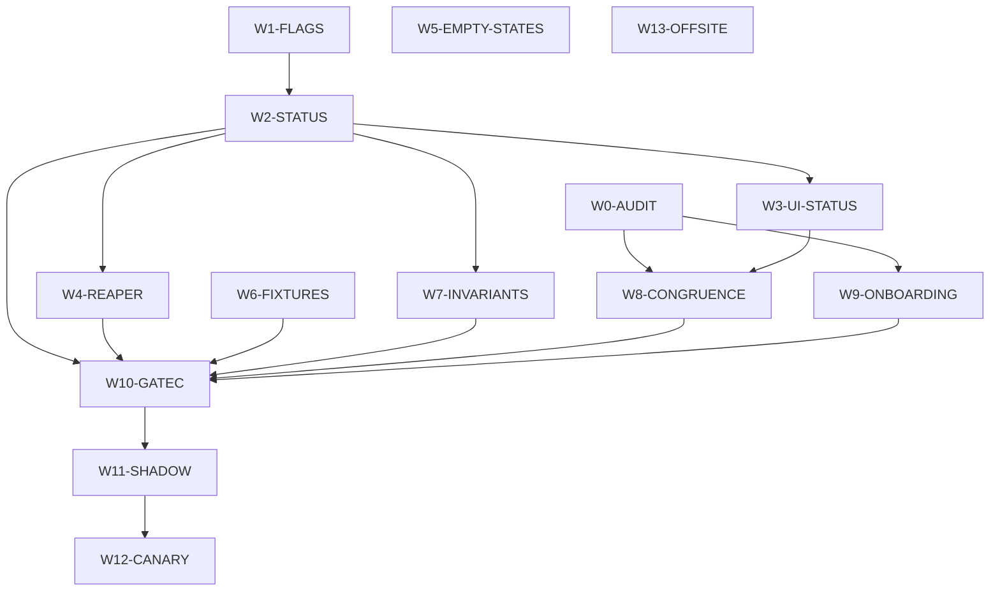

# Work graph

Machine-readable source: `03-plan/WORK-UNITS.yaml`. Validated acyclic on 4 September 2026.

## Critical path

`W1-FLAGS` to `W2-STATUS` to `W8-CONGRUENCE` to `W10-GATEC` to `W11-SHADOW` to `W12-CANARY`.

Everything else is either off the path (W5, W6, W13) or joins it late (W3, W4, W7, W9).

## The bottleneck

`W2-STATUS`. It owns the shared schema files, it cannot run concurrently with `W1-FLAGS`, three units depend on it, and it carries the two highest risks in `02-architecture/RISKS.md`. If one thing gets the best agent and the most review, it is this unit.

## Exclusive write ownership

Checked per wave. No two units in the same wave own the same writable path. `Lead.json` and `server/src/db/schema.js` are owned by W1 in wave 0 and by W2 in wave 1, never at the same time. Client component trees are partitioned: `leads/` to W3, `tables/` and `operations/` to W8, `cards/` and `Overview.jsx` to W5, `distribution/StuckLeadsCard.jsx` to W4, `pages/onboarding/` to W9.
